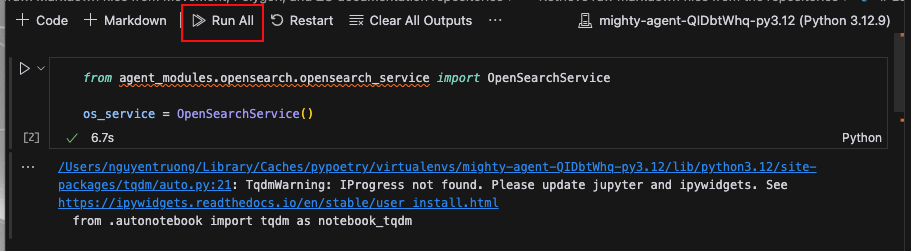

# Nillion Movement POC

## Introduction
This is the Nillion Movement POC

## Prerequisites
1. **Ollama**: Install Ollama locally. Follow the [Ollama Installation Guide](https://ollama.com/download/mac).
2. **Brew**: Install Homebrew. Follow the [Homebrew Installation Guide](https://brew.sh/).
3. **Docker**: Install Docker. Follow the [Docker Installation Guide](https://docs.docker.com/get-docker/).

## Python and SQLiteVec configuration for compatibility on Mac
*(Due to [this issue](https://stackoverflow.com/questions/58892028/sqlite3-connection-object-has-no-attribute-enable-load-extension))*  

### 1. Install SQLite for Mac
```bash
brew install sqlite
```

### 2. Install Python via Homebrew  
*(Follow the workaround outlined in the [SQLiteVec documentation](https://alexgarcia.xyz/sqlite-vec/python.html#macos-blocks-sqlite-extensions-by-default))*  
```bash
brew install python@3.12
```

### 3. Verify the Python Version
```bash
python3.12 --version
```
The Python version should display as `3.12.*`.

## Finetune models for the classifier
### 1. Change directory to the `nillion_movement_poc/agent_modules` directory

### 2. Make sure poetry uses the correct Python version
```bash
poetry env use python3.12
```

### 3. Run the poetry install command
```bash
poetry install
```

### 4. Finetune the blockchain action classifier
```bash
poetry run python agent_modules/classifier/blockchain_action/finetune_blockchain_actions.py
```

### 5. Finetune the domain classifier
```bash
poetry run python agent_modules/classifier/domain/train_domain_classifier_distilbert.py
```

## Run the poetry install to create the virtual environment and install the dependencies
### 1. Change directory to the `nillion_movement_poc/mighty_agent` directory

### 2. Make sure poetry uses the correct Python version
```bash
poetry env use python3.12
```

### 3. Run the poetry install command
```bash
poetry install
```

## OpenSearch data setup
### 1. Start the OpenSearch container (run from the `nillion_movement_poc/mighty_agent` directory):
```bash
docker compose -f opensearch/docker-compose.ci.yml up -d
```

### 2. Insert the data into OpenSearch by running the `/mighty_agent/opensearch/opensearch_insert_docs.ipynb` notebook.
**Make sure you are choosing the correct interpreter in the notebook by following the steps below:**
- Check the current python virtual environment:
```bash
poetry env info
```
Sample output:
```
Virtualenv
Python:         3.12.9
Implementation: CPython
Path:           /Users/nguyentruong/Library/Caches/pypoetry/virtualenvs/mighty-agent-QIDbtWhq-py3.12
Executable:     /Users/nguyentruong/Library/Caches/pypoetry/virtualenvs/mighty-agent-QIDbtWhq-py3.12/bin/python
Valid:          True

Base
Platform:   darwin
OS:         posix
Python:     3.12.9
Path:       /opt/homebrew/opt/python@3.12/Frameworks/Python.framework/Versions/3.12
Executable: /opt/homebrew/opt/python@3.12/Frameworks/Python.framework/Versions/3.12/bin/python3.12
```

### 3. Choose the interpreter that matches the virtual environment showed above (which is `/Users/nguyentruong/Library/Caches/pypoetry/virtualenvs/mighty-agent-QIDbtWhq-py3.12` in my case)

### 4. Run the notebook with the correct interpreter (with VSCode-based notebook, click the `Run All` button):


## Install ollama and required models
### 1. Make sure you have ollama installed

### 2. Install the required models
```bash
ollama run llama3.2:3b
```

## Run the chat application
```bash
poetry run chainlit run app.py
```